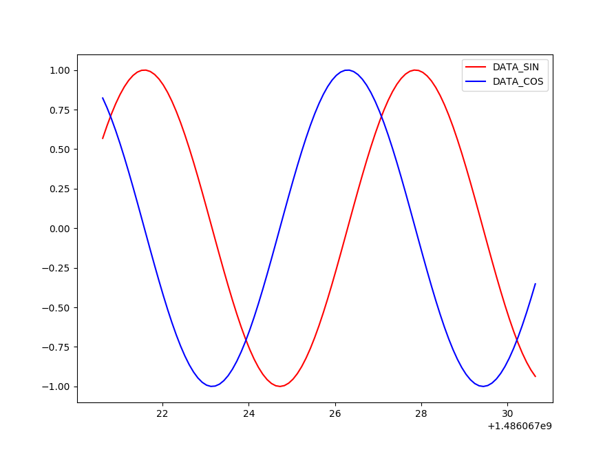

# Plotting data using `matplotlib`

In this example, `sinewave.py` generates data: **DATA_SIN** and **DATA_COS**
that are then plotted by `plotter.py` using `matplotlib`.

## Usage
```shell
pAntler plot_example.py
```

## Example output

