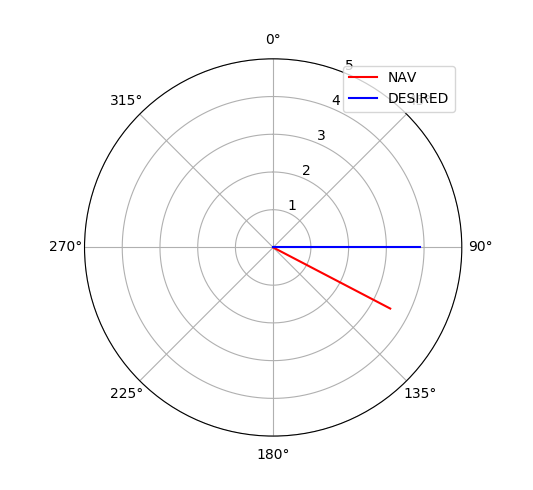

# Plotting Alpha Mission Decisions

The [alpha mission][alpha] is an example mission of [`moos-ivp`][ivp] marine autonomy
suite.
Therefore it is required to install `moos-ivp` to get the same results.
Instructions on how to install `moos-ivp` can be found [here][install].

In this example, `plotter.py` draws **NAV_SPEED**/**NAV_HEADING** and **DESIRED_SPEED**/**DESIRED_HEADING** on polar coordinates.

## Usage
```shell
pAntler alpha.moos
```

## Example output



[alpha]: http://oceanai.mit.edu/ivpman/pmwiki/pmwiki.php?n=Helm.XMissAlpha
[ivp]: http://moos-ivp.org/
[install]: https://github.com/moos-tutorials/00-my-first-moos-project
